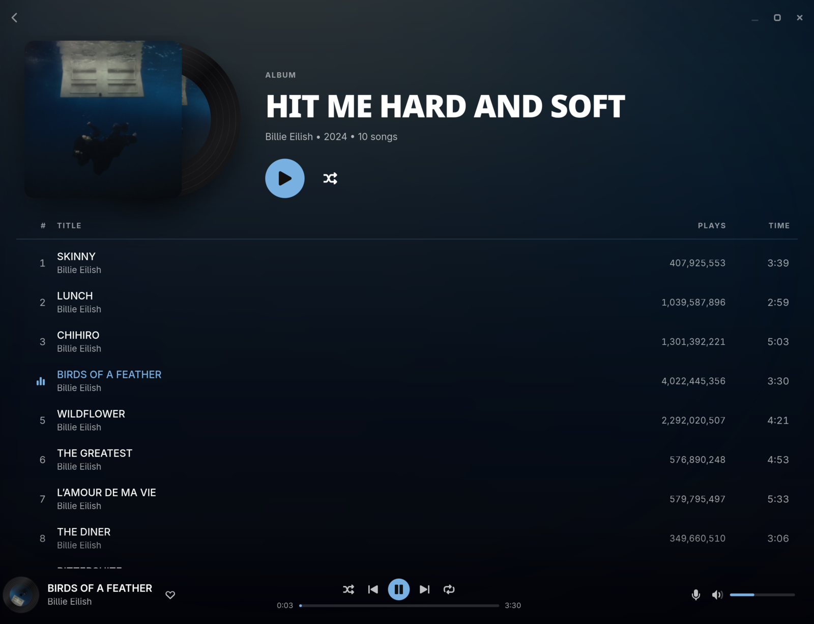

# onIfy

[](https://github.com/orqz/onIfy/releases/latest)
[](https://github.com/orqz/onIfy/releases)
[](LICENSE)

A lightweight Spotify client

**Main features**:
- Easy to install
- Native app (Rust + GTK), no Electron or web view
- Starts in under a second and uses way less RAM and CPU than the official client
- Clean Vinyl theme + Liquid glass theme
- Play counts, synced lyrics and local files
- Discord status and Last.fm scrobbling (detected as the official spotify client)
- Media keys and now playing controls on every OS
- Auto updates on Windows and macOS

Needs Spotify Premium.



## Installing

Grab the [latest release](https://github.com/orqz/onIfy/releases/latest):
- Windows: `onIfy-setup-x86_64.exe`
- macOS (Apple Silicon, 15+): `onIfy-macos-arm64.dmg`. It isn't notarized, so right click → Open the first time
- Linux: `onIfy-x86_64.flatpak`, install it with `flatpak install --user onIfy-x86_64.flatpak`

## Join our Discord Server

https://discord.gg/mrevdwV434

## Building from Source

You need Rust, GTK 4.20+ and libadwaita 1.8+ (and libpulse on Linux)

```sh
git clone https://github.com/orqz/onIfy
cd onIfy

# Run it
cargo run --release

# Or install it as a package on Arch
cd packaging/arch && makepkg -si
```

## Disclaimer

Spotify is a trademark of Spotify AB and solely mentioned for the sake of descriptivity.
Mention of it does not imply any affiliation with or endorsement by Spotify AB.

<details>
<summary>Using onIfy breaks Spotify's terms of service</summary>

Third party clients are against Spotify's terms. onIfy plays music through [librespot](https://github.com/librespot-org/librespot) like a lot of other players do, but if your account is really important to you, you probably shouldn't use any third party client.

</details>

## License

MIT, see [LICENSE](LICENSE). Playback is based on [librespot](https://github.com/librespot-org/librespot) (MIT), in [`vendor/librespot-playback`](vendor/librespot-playback).
